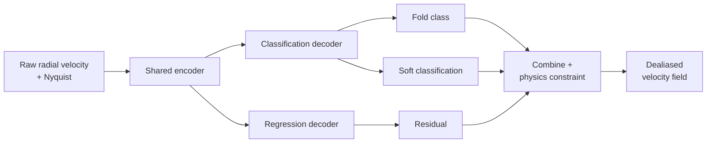
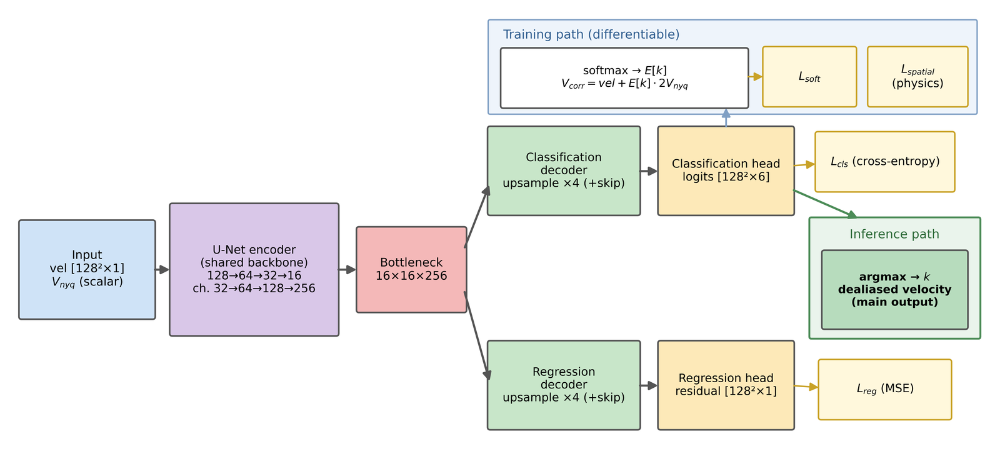
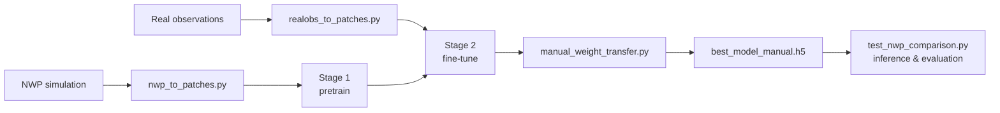
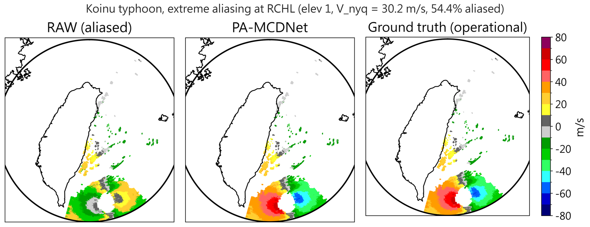
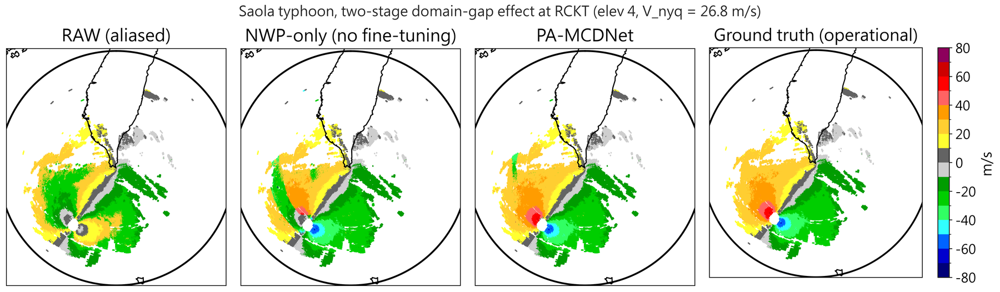
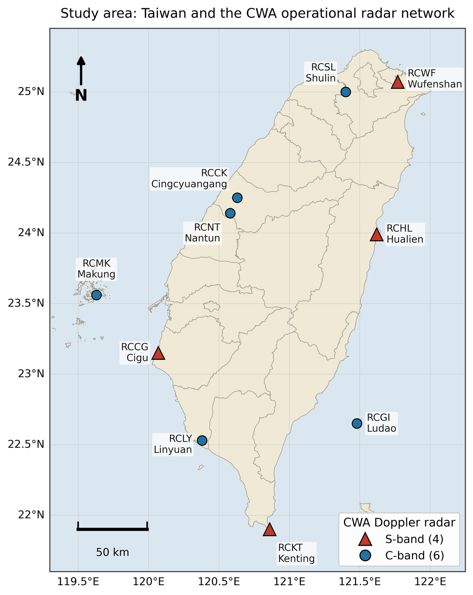

# PA-MCDNet: Physics-Aware Radar Doppler Velocity Dealiasing

**English** | [繁體中文](README.zh-TW.md)

A deep-learning model for **Doppler velocity dealiasing** of weather-radar data.
When the true wind speed exceeds the Nyquist velocity, the observed radial
velocity folds; PA-MCDNet restores it to a continuous, physically consistent
velocity field. It is designed as an auxiliary and cross-validation tool
alongside operational dealiasing algorithms (e.g. VDAQC / SFDA), not a
replacement.

## Method

- **Architecture**: a U-Net with a shared encoder and **dual decoders** (fold
  classification + residual regression), plus a soft-classification branch.
- **Physics-aware loss**: `L = 2.0·L_cls + 0.1·L_reg + 0.5·L_soft + 10.0·L_spatial`,
  where `L_spatial` is a spatial physical-consistency constraint (the "PA" term).
- **Two-stage transfer learning**: Stage 1 pre-trains on NWP-simulated radar
  fields; Stage 2 fine-tunes on real radar observations.



<p align="center"></p>

<p align="center"><em>Full architecture: a shared U-Net encoder feeds a classification decoder (hard and soft branches) and a residual-regression decoder. The classification head drives both the differentiable training path (softmax expectation → soft-classification and spatial-smoothness losses) and the discrete inference path (argmax → dealiased velocity).</em></p>

## Highlights

On a locked test set of 200 real-observation cases:

| Metric | Value |
|---|---|
| Typhoon dealiasing success rate | ~96% |
| Overall success rate (incl. squall lines) | ~88% |
| False-modification rate | 0.39% |
| Velocity RMSE | 2.75 m/s |
| Inference time | < 60 ms per full sweep |

## Workflow



## Repository structure

```
.
├── nwp_to_patches.py            # preprocessing: NWP parquet → training patches
├── realobs_to_patches.py        # preprocessing: real-obs gz → fine-tune patches
├── convert_h5_to_tfrecord.py    # h5 → sharded tfrecord (required for multi-GPU)
├── transfer_learning_complete.py# training: Stage 1 (scratch) and Stage 2 (fine-tune)
├── manual_weight_transfer.py    # produce best_model_manual.h5 after Stage 2
├── test_nwp_comparison.py       # inference & evaluation (main entry point)
├── unet_model/                  # model definitions (encoder / decoders / layers)
├── mapdata201805310314/         # Taiwan shapefile for geo visualization
├── data/locked_*_test_set.json  # locked test-set definitions
├── docs/USAGE.md                # full parameter reference for every program
└── ... (helper modules & tools; see Programs below)
```

Large training data, trained model weights, and run outputs are **not** tracked
(see `.gitignore`); how to obtain them is described below.

## Programs

Full parameters for each program are in [docs/USAGE.md](docs/USAGE.md).

| Program | Role |
|---|---|
| `nwp_to_patches.py` | Preprocessing — NWP parquet → training patches |
| `realobs_to_patches.py` | Preprocessing — real-obs gz → fine-tune patches |
| `realobs_append_patches.py` | Append events to an existing patch set |
| `realobs_to_fullsweep.py` | Build a full-sweep dataset variant |
| `convert_h5_to_tfrecord.py` | Convert h5 → sharded tfrecord (multi-GPU) |
| `transfer_learning_complete.py` | Training — Stage 1 (scratch) and Stage 2 (fine-tune) |
| `manual_weight_transfer.py` | Produce the deployable `best_model_manual.h5` after Stage 2 |
| `test_nwp_comparison.py` | Inference & evaluation (main entry point) |
| `build_locked_test_sets.py` | Build the fixed (locked) test sets |
| `scan_realobs_alias.py` | Scan alias ratios of real observations and cache them |
| `unet_model/` | Model definitions (encoder, decoders, layers) |
| helper modules | `mixed_patch_*`, `improved_physics_constraints.py`, `dealiasing_pre_patch_v2.py`, `dealiasing_success_metrics.py`, `batch_test_nwp.py`, `temporal_smoothing.py`, `physics_based_dealiasing_metrics.py`, `fix_typing.py` — imported by the programs above; not run directly |

## Installation

Requires **Python 3.10** and **TensorFlow 2.10** (which bundles Keras 2.10).
A GPU is recommended for training; inference also runs on CPU.

```bash
conda create -n pyart2 python=3.10 -y
conda activate pyart2

# GPU users only — TensorFlow 2.10 requires CUDA 11.2 and cuDNN 8.1, e.g.:
#   conda install -c conda-forge cudatoolkit=11.2 cudnn=8.1.0

# Core packages (versions pinned to the tested environment)
pip install tensorflow==2.10.0 \
            numpy==1.26.4 scipy==1.15.3 pandas==2.3.2 h5py==3.14.0 \
            pyarrow==22.0.0 matplotlib==3.8.4 \
            scikit-image==0.25.1 scikit-learn==1.6.1 opencv-python==4.11.0.86
```

Geo visualization is optional and additionally needs `pyart` and `basemap`:

```bash
pip install arm_pyart basemap basemap-data pyproj==3.6.1 pillow
```

Without these, inference still runs but geo images are skipped. `basemap` can be
difficult to install on some systems (it needs the system `geos` and `proj`
libraries).

## Quick start (inference)

Obtain a model weight (see [Model weights](#model-weights)), then run inference
on a folder of PPI files:

```bash
python test_nwp_comparison.py \
  --model_path path/to/best_model_manual.h5 \
  --inference_input path/to/ppi_folder \
  --output_dir infer_out \
  --use_physics_model \
  --enable_geo_viz --shape_path mapdata201805310314/COUNTY_MOI_1070516 \
  --downsample_720 --save_fields
```

Outputs land in `infer_out/`: dealiased velocity fields (`_fields/*.npz`) and
geo images (`*_geo_*.png`). The `--inference_input` argument accepts a single
`.gz` file or a folder; the Nyquist velocity is read from the file header.

> **Sample data.** Raw radar files are not bundled here: the CWA observations,
> the operational reference products, and the NWP-simulated fields are all
> subject to the Central Weather Administration's data policy and cannot be
> redistributed by the authors (see the Data Availability Statement). To try the
> pipeline, point `--inference_input` at your own PPI `.gz` files. The trained
> weight is provided in the Zenodo deposit, and `data/locked_*_test_set.json`
> here lists exactly which cases were used.

## Example

**Extreme aliasing — Koinu typhoon (RCHL, 54.4% of the sweep folded).** Left to
right: raw (folded) field, PA-MCDNet correction, and the operational reference.
The model reconstructs the complete tropical-cyclone velocity dipole at a success
rate of 99.98%.



**Two-stage transfer — Saola typhoon (RCKT).** Left to right: raw field,
NWP-pretrained-only model (no fine-tuning), PA-MCDNet, and the operational
reference. NWP pre-training alone recovers the dipole but leaves granular noise;
real-observation fine-tuning yields a smooth, reference-consistent field.



Running the quick-start command reproduces this kind of before/after for each
case: the `*_geo_raw.png` (before) and `*_geo_ours.png` (after) files in
`infer_out/` show the folding removed and the velocity field restored to
continuity.

## Preprocessing

Turn raw radar / NWP files into the training TFRecords used by the next section.
Full parameters are in [docs/USAGE.md](docs/USAGE.md).

```bash
# NWP → patches → tfrecord (Stage 1 input)
python nwp_to_patches.py --nwp_root <NWP parquet root> \
  --output_h5 data/nwp_patches.h5 \
  --target_stations RCCG RCWF RCHL RCKT RCGI --aliased_ratio 0.9
python convert_h5_to_tfrecord.py --h5_path data/nwp_patches.h5 \
  --output_dir data/nwp_tfrecord --splits train,val --num_shards 32 --compression GZIP

# Real observations → patches → tfrecord (Stage 2 input)
python realobs_to_patches.py --realobs_root <typhoonnew root> \
  --output_h5 data/realobs_patches.h5 \
  --train_cases 2021_Chanthu 2023_DOKSURI 2023_HAIKUI
python convert_h5_to_tfrecord.py --h5_path data/realobs_patches.h5 \
  --output_dir data/realobs_tfrecord --splits train,val --num_shards 32 --compression GZIP
```

## Training (two stages)

Multi-GPU training requires TFRecord input (a single h5 cannot be sharded across
GPUs). Convert first, then train.

```bash
# Stage 1 — pretrain on NWP (from scratch)
python transfer_learning_complete.py \
  --nwp_h5 data/nwp_tfrecord --output_dir results/stage1 \
  --freeze_ratio 0.0 --learning_rate 5e-5 --batch_size 2048 --epochs 200 --patience 5 \
  --lambda_cls 2.0 --lambda_reg 0.1 --lambda_soft 0.5 --lambda_spatial 10.0 \
  --lambda_physics 0.0 --lambda_confidence 0.0

# Stage 2 — fine-tune on real observations
python transfer_learning_complete.py \
  --pretrained_model results/stage1/best_model.h5 \
  --nwp_h5 data/realobs_tfrecord --output_dir results/stage2 \
  --freeze_ratio 0.3 --learning_rate 5e-5 --batch_size 2048 --epochs 100 --patience 5 \
  --lambda_cls 2.0 --lambda_reg 0.1 --lambda_soft 0.5 --lambda_spatial 10.0
```

Note: loss-weight defaults differ from the paper (e.g. `--lambda_spatial`
defaults to 50); always pass them explicitly as above. After Stage 2, run
`manual_weight_transfer.py` to produce `best_model_manual.h5` for deployment
(the fine-tuned `best_model.h5` may not load directly on newer TensorFlow).
See [docs/USAGE.md](docs/USAGE.md) for every parameter.

## Model weights

The trained weight is not tracked in the repository (size / data licensing). The
deployable weight `best_model_manual.h5` (~79 MB) is available from the author,
or on the deployment machine at `results/final_model/best_model_manual.h5`. Pass
its path to `--model_path`.

## Data

<p align="center"></p>

<p align="center"><em>The ten-radar CWA operational Doppler network (4 S-band, 6 C-band) that provides the training and evaluation observations.</em></p>

Training and evaluation data are S-band weather-radar observations (raw radial
velocity `bvel_raw` and reference `bvel_sfda` / `bvel_vdaqc`) and matching
NWP-simulated fields. These are not redistributed here; the preprocessing scripts
turn the raw radar/NWP files into training patches. `data/locked_*_test_set.json`
record which cases form the fixed test sets (file paths in them are placeholders
to be pointed at your own data).

## Third-party comparison model

The evaluation can compare against **UNet-VDA** (a U.S. operational dealiasing
model). It is **not** bundled here — obtain it from its original source and
point `--paper_model_path` at its SavedModel directory. Pure inference does not
require it.

## License

Released under the MIT License — see [LICENSE](LICENSE).
