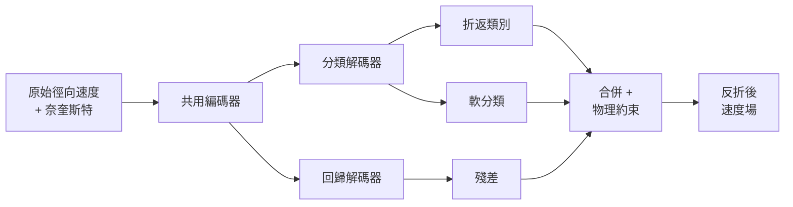
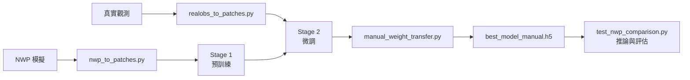

# PA-MCDNet：物理約束雷達都卜勒速度反折錯

[English](README.md) | **繁體中文**

用於氣象雷達資料**都卜勒速度反折錯**的深度學習模型。當實際風速超過奈奎斯特速度時，觀測到的徑向速度會發生折返；PA-MCDNet 將其還原為連續且符合物理的速度場。本模型定位為現行作業化反折錯演算法（如 VDAQC / SFDA）的輔助與交叉驗證工具，並非取代。

## 方法

- **架構**：U-Net，共用編碼器搭配**雙解碼器**（折返分類 + 殘差回歸），另含一個軟分類分支。
- **物理約束損失**：`L = 2.0·L_cls + 0.1·L_reg + 0.5·L_soft + 10.0·L_spatial`，其中 `L_spatial` 為空間物理一致性約束（即「PA」項）。
- **兩階段遷移學習**：Stage 1 於 NWP 模擬雷達場預訓練；Stage 2 於真實雷達觀測微調。



<p align="center"></p>

<p align="center"><em>完整架構:共用 U-Net 編碼器接上分類解碼器（hard 與 soft 分支）與殘差回歸解碼器。分類頭同時驅動可微分的訓練路徑（softmax 期望 → 軟分類與空間平滑損失）與離散的推論路徑（argmax → 反折後速度）。</em></p>

## 成效

於 200 個真實觀測案例的鎖定測試集：

| 指標 | 數值 |
|---|---|
| 颱風反折錯成功率 | 約 96% |
| 整體成功率（含颮線） | 約 88% |
| 誤修率 | 0.39% |
| 速度均方根誤差 | 2.75 m/s |
| 推論時間 | 每張全圖低於 60 毫秒 |

## 流程



## 專案結構

```
.
├── nwp_to_patches.py            # 前處理：NWP parquet → 訓練 patch
├── realobs_to_patches.py        # 前處理：真實觀測 gz → 微調 patch
├── convert_h5_to_tfrecord.py    # h5 → 分片 tfrecord（多張 GPU 必要）
├── transfer_learning_complete.py# 訓練：Stage 1（從零）與 Stage 2（微調）
├── manual_weight_transfer.py    # Stage 2 後產生 best_model_manual.h5
├── test_nwp_comparison.py       # 推論與評估（主要進入點）
├── unet_model/                  # 模型定義（編碼器／解碼器／層）
├── mapdata201805310314/         # 地理可視化用的台灣 shapefile
├── data/locked_*_test_set.json  # 鎖定測試集定義
├── docs/USAGE.md                # 每支程式的完整參數說明
└── ... （其他相依模組與工具，見下方「程式一覽」）
```

大型訓練資料、訓練好的模型權重、以及執行輸出**不納入版本控制**（見 `.gitignore`）；取得方式見下方說明。

## 程式一覽

每支程式的完整參數見 [docs/USAGE.md](docs/USAGE.md)。

| 程式 | 角色 |
|---|---|
| `nwp_to_patches.py` | 前處理 —— NWP parquet → 訓練 patch |
| `realobs_to_patches.py` | 前處理 —— 真實觀測 gz → 微調 patch |
| `realobs_append_patches.py` | 於既有 patch 集追加事件 |
| `realobs_to_fullsweep.py` | 建立全掃描（full-sweep）資料集變體 |
| `convert_h5_to_tfrecord.py` | h5 → 分片 tfrecord（多張 GPU） |
| `transfer_learning_complete.py` | 訓練 —— Stage 1（從零）與 Stage 2（微調） |
| `manual_weight_transfer.py` | Stage 2 後產生可部署的 `best_model_manual.h5` |
| `test_nwp_comparison.py` | 推論與評估（主要進入點） |
| `build_locked_test_sets.py` | 建立固定（鎖定）測試集 |
| `scan_realobs_alias.py` | 掃描真實觀測的折返比例並快取 |
| `unet_model/` | 模型定義（編碼器、解碼器、層） |
| 相依模組 | `mixed_patch_*`、`improved_physics_constraints.py`、`dealiasing_pre_patch_v2.py`、`dealiasing_success_metrics.py`、`batch_test_nwp.py`、`temporal_smoothing.py`、`physics_based_dealiasing_metrics.py`、`fix_typing.py` —— 由上列程式匯入，不直接執行 |

## 安裝

需要 **Python 3.10** 與 **TensorFlow 2.10**（內含 Keras 2.10）。訓練建議用 GPU；推論在 CPU 也可執行。

```bash
conda create -n pyart2 python=3.10 -y
conda activate pyart2

# 僅 GPU 使用者 —— TensorFlow 2.10 需要 CUDA 11.2 與 cuDNN 8.1，例如：
#   conda install -c conda-forge cudatoolkit=11.2 cudnn=8.1.0

# 核心套件（版本鎖定為實測環境）
pip install tensorflow==2.10.0 \
            numpy==1.26.4 scipy==1.15.3 pandas==2.3.2 h5py==3.14.0 \
            pyarrow==22.0.0 matplotlib==3.8.4 \
            scikit-image==0.25.1 scikit-learn==1.6.1 opencv-python==4.11.0.86
```

地理可視化為選用，另需 `pyart` 與 `basemap`：

```bash
pip install arm_pyart basemap basemap-data pyproj==3.6.1 pillow
```

未安裝這些仍可推論，只是不輸出地理圖。`basemap` 在部分系統較難安裝（需系統的 `geos` 與 `proj` 函式庫）。

## 快速開始（推論）

先取得模型權重（見 [模型權重](#模型權重)），再對一個裝有 PPI 檔案的資料夾執行推論：

```bash
python test_nwp_comparison.py \
  --model_path path/to/best_model_manual.h5 \
  --inference_input path/to/ppi_folder \
  --output_dir infer_out \
  --use_physics_model \
  --enable_geo_viz --shape_path mapdata201805310314/COUNTY_MOI_1070516 \
  --downsample_720 --save_fields
```

輸出落在 `infer_out/`：反折後速度場（`_fields/*.npz`）與地理圖（`*_geo_*.png`）。`--inference_input` 可接受單一 `.gz` 檔或整個資料夾；奈奎斯特速度自檔頭讀取。

> **範例資料。** 此處不附雷達原始檔：CWA 觀測、作業參考產品、以及 NWP 模擬場皆受中央氣象署資料政策規範，作者無法轉散布（見資料可用性聲明）。若要試跑，請將 `--inference_input` 指向你自己的 PPI `.gz` 檔。訓練權重放在 Zenodo 典藏；此處的 `data/locked_*_test_set.json` 已列明用到哪些案例。

## 範例

**極端折錯 —— 小犬颱風（RCHL，單張掃描 54.4% 折錯）。** 由左至右：原始（折錯）速度場、PA-MCDNet 修正、作業化參考真值。模型在此完整還原颱風速度偶極，成功率 99.98%。


**兩階段遷移 —— 蘇拉颱風（RCKT）。** 由左至右：原始速度場、僅 NWP 預訓練（未微調）、PA-MCDNet、作業化參考真值。僅 NWP 預訓練已能還原偶極但殘留顆粒雜訊；經真實觀測微調後得到平滑、與參考一致的速度場。


執行快速開始即可對每個案例重現這類反折前後對照：`infer_out/` 內的 `*_geo_raw.png`（反折前）與 `*_geo_ours.png`（反折後）即可看出折返被消除、速度場恢復連續。

## 前處理

將原始雷達／NWP 檔轉為下一節訓練所用的 TFRecord。完整參數見 [docs/USAGE.md](docs/USAGE.md)。

```bash
# NWP → patch → tfrecord（Stage 1 輸入）
python nwp_to_patches.py --nwp_root <NWP parquet 根目錄> \
  --output_h5 data/nwp_patches.h5 \
  --target_stations RCCG RCWF RCHL RCKT RCGI --aliased_ratio 0.9
python convert_h5_to_tfrecord.py --h5_path data/nwp_patches.h5 \
  --output_dir data/nwp_tfrecord --splits train,val --num_shards 32 --compression GZIP

# 真實觀測 → patch → tfrecord（Stage 2 輸入）
python realobs_to_patches.py --realobs_root <typhoonnew 根目錄> \
  --output_h5 data/realobs_patches.h5 \
  --train_cases 2021_Chanthu 2023_DOKSURI 2023_HAIKUI
python convert_h5_to_tfrecord.py --h5_path data/realobs_patches.h5 \
  --output_dir data/realobs_tfrecord --splits train,val --num_shards 32 --compression GZIP
```

## 訓練（兩階段）

多張 GPU 訓練需要 TFRecord 輸入（單一 h5 無法在多張 GPU 間分片）。先轉檔，再訓練。

```bash
# Stage 1 —— 於 NWP 預訓練（從零開始）
python transfer_learning_complete.py \
  --nwp_h5 data/nwp_tfrecord --output_dir results/stage1 \
  --freeze_ratio 0.0 --learning_rate 5e-5 --batch_size 2048 --epochs 200 --patience 5 \
  --lambda_cls 2.0 --lambda_reg 0.1 --lambda_soft 0.5 --lambda_spatial 10.0 \
  --lambda_physics 0.0 --lambda_confidence 0.0

# Stage 2 —— 於真實觀測微調
python transfer_learning_complete.py \
  --pretrained_model results/stage1/best_model.h5 \
  --nwp_h5 data/realobs_tfrecord --output_dir results/stage2 \
  --freeze_ratio 0.3 --learning_rate 5e-5 --batch_size 2048 --epochs 100 --patience 5 \
  --lambda_cls 2.0 --lambda_reg 0.1 --lambda_soft 0.5 --lambda_spatial 10.0
```

注意：損失權重的預設值與論文不同（例如 `--lambda_spatial` 預設為 50），務必如上明確帶齊。Stage 2 完成後，執行 `manual_weight_transfer.py` 產生部署用的 `best_model_manual.h5`（微調後的 `best_model.h5` 在較新版本的 TensorFlow 可能無法直接載入）。每個參數見 [docs/USAGE.md](docs/USAGE.md)。

## 模型權重

訓練好的權重因體積與資料授權未納入版本控制。可部署的權重 `best_model_manual.h5`（約 79 MB）請向作者索取，或在部署機器上位於 `results/final_model/best_model_manual.h5`。將其路徑傳給 `--model_path`。

## 資料

<p align="center"></p>

<p align="center"><em>供訓練與評估之中央氣象署 10 座作業化都卜勒雷達網（4 座 S 波段、6 座 C 波段）。</em></p>

訓練與評估資料為 S 波段氣象雷達觀測（原始徑向速度 `bvel_raw` 與參考真值 `bvel_sfda` / `bvel_vdaqc`）以及對應的 NWP 模擬場。這些資料未在此重散布；前處理程式會將原始雷達／NWP 檔轉為訓練 patch。`data/locked_*_test_set.json` 記錄哪些案例組成固定測試集（其中的檔案路徑為佔位，需指向你自己的資料）。

## 第三方比較模型

評估時可與 **UNet-VDA**（美國作業化反折錯模型）比較。本專案**未**內含它 —— 請自其原始來源取得，並以 `--paper_model_path` 指向其 SavedModel 目錄。純推論不需要它。

## 授權

以 MIT 授權釋出 —— 見 [LICENSE](LICENSE)。
